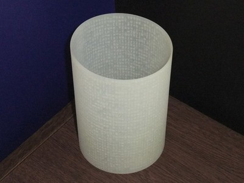
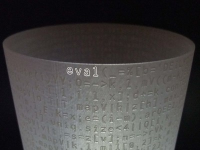
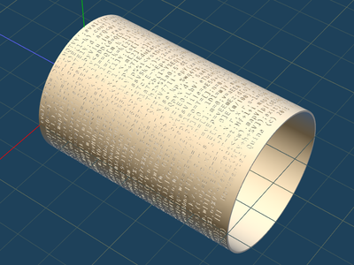

# Monumental Quine

This is a monument that commemorates my book's release: ["The world of obfuscated, esoteric, artistic programming"]()!  (Sorry, it is written in Japanese!)

It has a spiral releaf of a long one-liner Ruby program that generates a 3D model of this column itself.  Save it as a file `mquine.rb` and execute:

    $ ruby mquine.rb > mquine.obj

And then open the generated file (in Wavefront OBJ format) with your favorite 3D model viewer.

## How to get a copy of the object

Available in [my Shapeways shop](http://www.shapeways.com/shops/mametter).  Just $198.00!  (95% is a cost for 3D printing.  I will get a margin of $10 per object.  I will use it to improve and maintain this project :-)

If you just want to get a 3D model, or if you want me not to earn money, you can generate the data in the following way:

    $ git clone https://github.com/mame/monumental-quine.git
    $ cd monumental-quine
    $ bundle install
    $ bundle exec rake  # may take a few minutes

Then you will get `mquine.rb` and `mquine.obj`.

## Internal

                      compile.rb
    [setup-font.rb] ----------------> [setup-font.src] ---+
                                                          |
                                                          |
                      compile.rb                          |
    [triangulate.rb] ---------------> [triangulate.src] --+
                                                          | mquine.rb.gen.rb
                                                          +------------------> [mquine.rb]
                      compile.rb                          |
    [make-obj.rb] ------------------> [make-obj.src] -----+
                                                          |
                                                          |
                    font.dat.gen.rb                       |
    [glyphs/*.txt] -----------------> [font.dat] ---------+

* `setup-font.rb`, `triangulate.rb`, and `make-obj.rb` are source code.
  * `setup-font.rb` decodes the font data and convert the curves to polygons.
  * `triangulate.rb` triangulates the polygons (with holes) to triangles.
  * `make-obj.rb` generates an OBJ data by composing the font triangles.
* `glyphs/*.txt` is a tiny outline font with quadratic Bézier curves.
  * The current glyphs are created by tracing [Inconsolata](http://www.levien.com/type/myfonts/inconsolata.html).
  * Use `foreman start` and livereload to view and edit glyphs.
* Modify `config.rb` to change the column shape, font size, etc.

## Related work

[Trajan's Column](http://en.wikipedia.org/wiki/Trajan%27s_Column): the most famous monumental column for its spiral bas relief

## License

 Monumental Quine by <a xmlns:cc="http://creativecommons.org/ns#" href="https://github.com/mame/monumental-quine/" property="cc:attributionName" rel="cc:attributionURL">Yusuke Endoh</a> is licensed under a <a rel="license" href="http://creativecommons.org/licenses/by-nc-sa/4.0/">Creative Commons Attribution-NonCommercial-ShareAlike 4.0 International License</a>.
